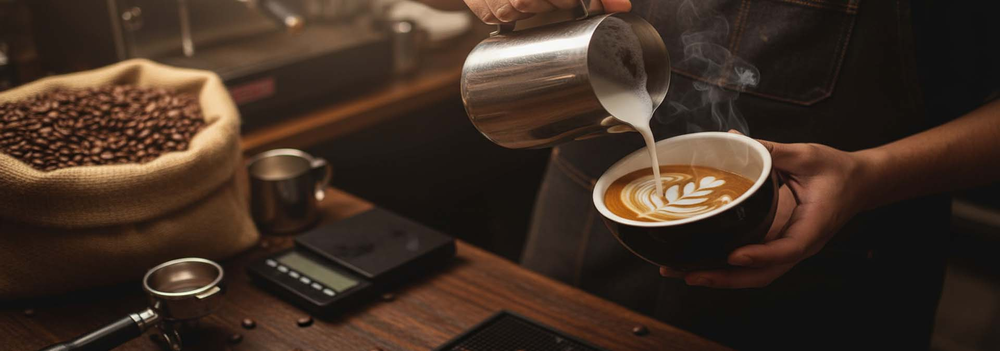
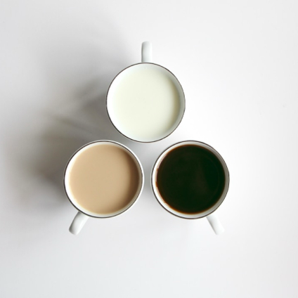
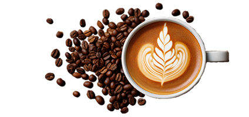
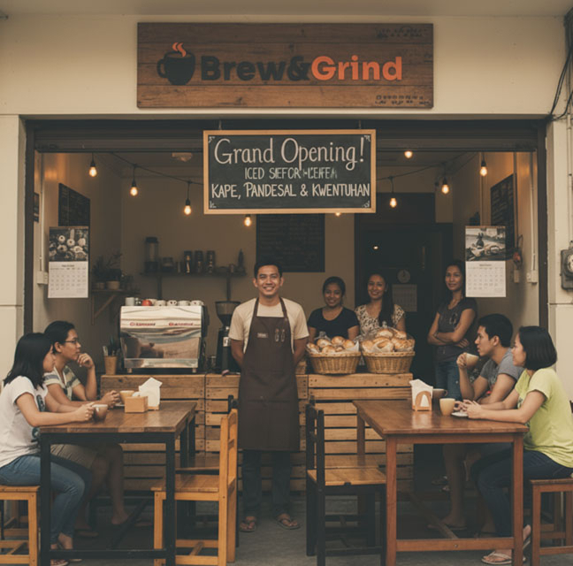
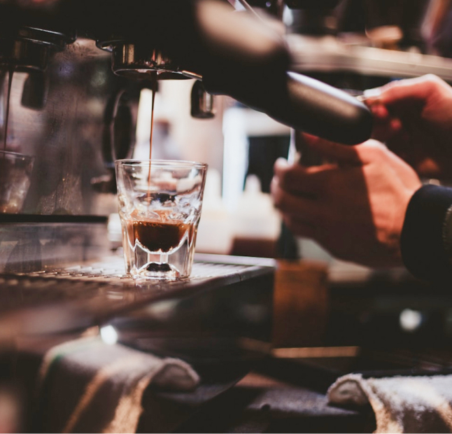
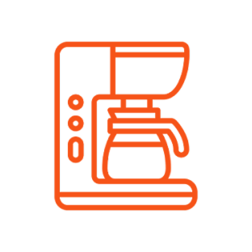
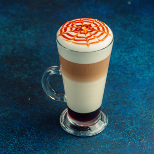

# Brew & Grind Website — Technical Documentation (HTML/CSS Analysis)

## Table of Contents

1. [Project Overview](#project-overview)
2. [Navigation System](#navigation-system)
3. [Home (index.html) Page Structure](#home-indexhtml-page-structure)
4. [About (about.html) Page Structure](#about-abouthtml-page-structure)
5. [Our Menu (our-menu.html) Page Structure](#our-menu-our-menuhtml-page-structure)
6. [Contact Us (contact-us.html) Page Structure](#contact-us-contact-ushtml-page-structure)
7. [CSS Structure Analysis](#css-structure-analysis)
8. [JavaScript Implementation](#javascript-implementation)
9. [Quick Reference: Component Glossary](#quick-reference-component-glossary)

---

## Project Overview

This is a **custom-built** responsive website for Brew & Grind coffee shop. The project uses a hand-crafted 12-column grid system, custom CSS, and vanilla JavaScript for all interactions.

- **CSS Framework:** Custom 12-column flexbox grid system
- **Custom stylesheet:** `css/style.css` (includes all styles with mobile-first approach)
- **JavaScript:**
  - `js/script.js` (mobile navigation toggle)
  - `js/home.js` (custom image slider)
- **External assets:**
  - Bootstrap Icons via CDN (`https://cdnjs.cloudflare.com/ajax/libs/bootstrap-icons/1.13.1/...`)
  - Google Fonts imported in CSS (`Lora`, `Work Sans`)
  - Google Maps embed via `<iframe>` on Contact page

**Key Technical Features:**

- Mobile-first responsive design
- Custom flexbox-based 12-column grid system
- Vanilla JavaScript (no frameworks or libraries)
- CSS custom properties (variables) for theming
- Semantic HTML5 elements throughout
- Sticky navigation header
- Custom image carousel/slider
- Responsive breakpoints: 576px (sm), 768px (md), 992px (lg), 1200px (xl), 1400px (2xl)

---

## Navigation System

### Implementation (HTML)

All pages share the same navigation structure with both mobile and desktop variants:

```html
<header class="header">
  <div class="row">
    <!-- Mobile navigation (visible on small screens) -->
    <nav class="mobile-nav">
      <a href="#" class="nav__img">
        
      </a>
      <i class="bi bi-list" id="hamburger-menu"></i>
    </nav>

    <!-- Desktop navigation (hidden on mobile, visible on tablets and above) -->
    <nav class="desktop-nav">
      <a href="#" class="nav__img">
        
      </a>
      <ul class="navbar">
        <li><a class="navbar__item active" href="index.html">Home</a></li>
        <li><a class="navbar__item" href="about.html">About Us</a></li>
        <li><a class="navbar__item" href="our-menu.html">Our Menu</a></li>
        <li><a class="navbar__item" href="contact-us.html">Contact Us</a></li>
      </ul>
    </nav>
  </div>

  <!-- Mobile menu (hidden by default, toggled by JavaScript) -->
  <ul class="mobile-navbar">
    <li><a class="navbar__item active" href="index.html">Home</a></li>
    <li><a class="navbar__item" href="about.html">About Us</a></li>
    <li><a class="navbar__item" href="our-menu.html">Our Menu</a></li>
    <li><a class="navbar__item" href="contact-us.html">Contact Us</a></li>
  </ul>
</header>
```

**Key elements:**

- `.header` - Sticky positioned header with beige background (#ffedc5)
- `.mobile-nav` - Visible on mobile, contains logo and hamburger icon
- `.desktop-nav` - Hidden on mobile (`display: none`), visible at 992px+
- `#hamburger-menu` - Bootstrap Icons hamburger that toggles to X icon
- `.mobile-navbar` - Collapsible menu that slides down on mobile

**Active page highlighting:**

- Current page link uses: `.navbar__item.active`
- Applies orange accent color (#f8551a) and bold font weight (600)

### Implementation (CSS)

**Header styles:**

```css
.header {
  background-color: var(--color-secondary); /* #ffedc5 */
  padding: 0.9375rem 0;
  position: sticky;
  top: 0;
  z-index: 1000;
}
```

**Mobile navigation:**

```css
.mobile-nav {
  width: 100%;
  padding-inline: 0.75rem;
  display: flex;
  align-items: center;
  justify-content: space-between;
}

.mobile-navbar {
  display: none;
  opacity: 0;
  flex-direction: column;
  align-items: center;
  gap: 0.75rem;
  background: var(--color-secondary);
  position: fixed;
  top: 105.8px;
  width: 100%;
  z-index: 999;
  padding-bottom: 0.75rem;
  transform: translateY(-10px);
  transition:
    opacity 0.3s ease,
    transform 0.3s ease;
}

.mobile-navbar.show {
  display: flex;
  opacity: 1;
  transform: translateY(0);
  pointer-events: auto;
}
```

**Desktop navigation:**

```css
.desktop-nav {
  width: 100%;
  display: none;
  justify-content: space-between;
}

@media only screen and (min-width: 992px) {
  .mobile-nav {
    display: none;
  }

  .desktop-nav {
    display: flex;
  }

  .navbar {
    flex-direction: row;
  }
}
```

**Active link styling:**

```css
.navbar__item.active {
  color: var(--color-headings); /* #f8551a */
  font-weight: 600;
}
```

**Responsive behavior:**

- **Mobile (< 992px):** Hamburger menu with collapsible navbar
- **Desktop (≥ 992px):** Full horizontal menu with logo on left, links on right

### JavaScript Implementation

Toggle functionality in `js/script.js`:

```javascript
const mobileNav = document.querySelector(".mobile-navbar");
const hamburgerMenu = document.querySelector("#hamburger-menu");

hamburgerMenu.addEventListener("click", () => {
  mobileNav.classList.toggle("show");
  hamburgerMenu.classList.toggle("bi-list");
  hamburgerMenu.classList.toggle("bi-x");
});
```

- Toggles `.show` class to display/hide mobile menu
- Switches between hamburger (`bi-list`) and close (`bi-x`) icons

---

## Home (index.html) Page Structure

### **Page Purpose:**

Homepage that introduces Brew & Grind with a custom JavaScript-powered image slider, feature sections with video/images, a specialties grid, and customer testimonials.

### **Key Components:**

#### 1. **Navigation**

- Custom navigation system (see "Navigation System" section)
- Active state on Home link: `.navbar__item.active`

#### 2. **Custom Image Slider**

```html
<section id="slider-section">
  <div class="slider">
    <div class="track">
      <div class="slide">
        
      </div>
      <div class="slide">
        
      </div>
      <div class="slide">
        
      </div>
    </div>
  </div>
  <button id="prev"><i class="bi bi-chevron-left"></i></button>
  <button id="next"><i class="bi bi-chevron-right"></i></button>
</section>
```

**Slider implementation:**

- Custom JavaScript slider (not a CSS-only or library solution)
- Uses `translateX()` transforms for sliding animation
- Clones first and last slides for infinite loop effect
- Previous/next buttons positioned absolutely
- Smooth 0.8s ease-in-out transition
- Responsive to window resizing

**CSS for slider:**

```css
.slider {
  width: 100%;
  overflow: hidden;
}

.track {
  display: flex;
  transition: transform 0.8s ease-in-out;
}

.slide {
  flex: 0 0 100%;
}

#prev,
#next {
  position: absolute;
  top: 45%;
  padding: clamp(0.35rem, 0.2167rem + 0.6667vw, 0.75rem);
  background: black;
  color: white;
  border: none;
  cursor: pointer;
}
```

#### 3. **Humble Beginnings Section**

```html
<section class="feature">
  <div class="row reverse-md">
    <div class="col-12 col-6-md">
      <div class="div__center">
        <h2 class="feature__heading">Humble Beginnings</h2>
        <p class="feature__text">
          Brew & Grind opened its doors in 2014 at the vibrant corner of P.
          Noval and Dapitan St. in Sampaloc, Manila...
        </p>
      </div>
    </div>
    <div class="col-12 col-6-md">
      <video
        src="./video/brew-and-grind-video.mp4"
        controls
        width="100%"
        height="100%"
      ></video>
    </div>
  </div>
</section>
```

- `.feature` - Standard padding (3rem vertical)
- `.reverse-md` - Reverses column order at medium breakpoint (768px+)
- `.col-12 .col-6-md` - Full width on mobile, half width on medium+
- Native HTML5 `<video>` element with controls

#### 4. **Where Coffee Meets Community (Dark Theme)**

```html
<section class="feature--dark">
  <div class="row">
    <div class="col-12 col-6-md">
      <div class="div__center">
        <h2 class="feature--dark feature__heading">
          Where Coffee Meets Community
        </h2>
        <p class="feature--dark feature__text">
          Brew & Grind opened its doors in 2014...
        </p>
      </div>
    </div>
    <div class="col-12 col-6-md">
      
    </div>
  </div>
</section>
```

- `.feature--dark` - Dark teal background (#123132) with white text
- Standard two-column layout

#### 5. **Our Specialties Section**

```html
<section class="specialties">
  <div class="row">
    <div class="col-12 specialties__text">
      <h3>Our Specialties</h3>
      <p>Welcome to our menu—a celebration of flavor and craftsmanship...</p>
    </div>
  </div>

  <div class="row">
    <div class="col-12 col-4-md specialties__item">
      
      <div class="col-12 specialties__text">
        <h4>Expertly Crafted Coffee</h4>
        <p>Every cup is brewed with precision...</p>
      </div>
    </div>
    <!-- 2 more items -->
  </div>

  <div class="col-12 specialties__text">
    <a class="btn" href="our-menu.html">View Full Menu</a>
  </div>
</section>
```

- `.specialties` - Beige background (#ffedc5)
- Three-column grid: `.col-12 .col-4-md`
  - Mobile: Full width (stacked)
  - Medium (768px): Three columns side-by-side
- Centered text throughout
- Call-to-action button at bottom

#### 6. **What Our Patrons Say (Reviews)**

```html
<section class="reviews">
  <div class="row reviews__row">
    <h3>What Our Patrons Say</h3>
    <p>We're proud to have earned the trust of our patrons...</p>
  </div>
  <div class="row reviews__row">
    <div class="col-12 col-4-md reviews__item">
      
      <div class="reviews__text">
        <h4>Jack Amo</h4>
        <p>I loved the exceptional blend of rich coffee flavors...</p>
      </div>
    </div>
    <!-- 2 more review items -->
    <div class="reviews__text">
      <a class="btn" href="">View More</a>
    </div>
  </div>
</section>
```

- `.reviews__img` - Circular images using `border-radius: 50%`
- Three-column grid with reviews
- Centered layout

#### 7. **Footer**

```html
<footer class="footer">
  <div class="row col-12">
    <div class="col-12 col-6-sm col-3-md footer__item">
      <h4>About Us</h4>
      <p>Your neighborhood spot for great coffee...</p>
    </div>
    <!-- 3 more footer columns -->
  </div>
</footer>
```

- Four-column responsive grid
- `.col-12 .col-6-sm .col-3-md`
  - Mobile: 1 column (stacked)
  - Small (576px): 2 columns
  - Medium (768px): 4 columns
- Dark teal background (#123132) with white text

### **Layout Patterns:**

**Custom Grid System:**

- `.row` - Flexbox container with `flex-wrap: wrap`
- `.col-{size}` - Column classes (1-12) for base mobile layout
- `.col-{size}-{breakpoint}` - Responsive column classes
- Common breakpoints: `sm` (576px), `md` (768px), `lg` (992px), `xl` (1200px), `2xl` (1400px)

**Responsive Strategy:**

- Mobile-first approach (base styles without breakpoint suffix)
- `.col-12` makes content full-width on mobile
- Medium breakpoint (`.col-{size}-md`) switches to multi-column at 768px
- `.reverse-md` class reverses column order at medium+ using `flex-direction: row-reverse`

**Spacing & Alignment:**

- Section padding: `padding: 3rem 0` on all major sections
- `.div__center` - Flexbox utility for vertical centering
- Column padding: `padding: 0 0.75rem` on all `[class*="col-"]`

**Visual Hierarchy:**

- Alternating backgrounds: white, `.feature--dark` (dark teal), `.specialties` (beige)
- Consistent orange accent color (#f8551a) for headings
- Typography: Lora (serif) for headings, Work Sans (sans-serif) for body
- Fluid typography using `clamp()` function

### **Code Structure Notes:**

- **Semantic HTML:** `<header>`, `<nav>`, `<main>`, `<section>`, `<footer>`, `<video>`
- **Custom classes:** `.feature`, `.feature--dark`, `.specialties`, `.reviews`, `.btn` (all defined in style.css)
- **BEM-like naming:** `.feature__heading`, `.navbar__item`, `.reviews__img`
- **Accessibility:** Alt text on images, semantic landmarks, `controls` on video
- **Consistent patterns:** All sections use `3rem` vertical padding; `.row` wraps all content
- **Scripts at bottom:** JavaScript files loaded at end of `<body>` for faster page loading

---

## About (about.html) Page Structure

### **Page Purpose:**

Brand story page featuring a banner header, three content sections (Our Story, Mission & Vision, Founder Message), and footer.

### **Key Components:**

#### 1. **Navigation**

- Custom navigation with active state on "About Us" link: `.navbar__item.active`

#### 2. **Banner Header**

```html
<section class="banner">
  <div class="row banner__row">
    <div class="col-6 col-6-sm col-6-md">
      <h1 class="banner__row--text">About Us</h1>
    </div>
    <div class="col-6 col-6-sm col-6-md">
      
    </div>
  </div>
</section>
```

- `.banner` - Brown background (#6b372b)
- `.col-6` - Fixed 50/50 split at all screen sizes
- `.banner__row--text` - White text for heading
- `.banner__row--img` - Right-aligned decorative image

#### 3. **Our Story Section**

```html
<section class="feature">
  <div class="row reverse-md">
    <div class="col-12 col-6-md">
      <div class="div__center feature__row">
        <h2 class="feature__heading">Our Story</h2>
        <p class="feature__text">
          Brew & Grind first opened its doors in 2014...
        </p>
        <!-- More paragraphs -->
      </div>
    </div>
    <div class="col-12 col-6-md">
      
    </div>
  </div>
</section>
```

- `.reverse-md` - Image appears first on medium screens and up (768px+)
- Standard two-column layout with text and image
- `.div__center` - Vertically centers text content

#### 4. **Mission & Vision Section (Dark Theme)**

```html
<section class="feature--dark">
  <div class="row">
    <div class="col-12 col-6-md">
      <div class="div__center feature__row">
        <h2 class="feature--dark feature__heading">Our Mission - Vision</h2>
        <p class="feature--dark feature__text">
          At Brew&Grind, our mission is to serve exceptional coffee...
        </p>
        <!-- More paragraphs -->
      </div>
    </div>
    <div class="col-12 col-6-md">
      
    </div>
  </div>
</section>
```

- Dark teal background (`.feature--dark`)
- `.feature--dark.feature__heading` - Orange heading color maintained
- `.feature--dark.feature__text` - White text

#### 5. **Words From Our Founder Section**

```html
<section class="feature secondary">
  <div class="row reverse-md">
    <div class="col-12 col-6-md">
      <div class="div__center feature__row">
        <h2 class="feature__heading">Words from Our Founder</h2>
        <!-- Multiple paragraphs -->
        <div class="feature__text right-align">
          <p>Miguel "Migs" Santos</p>
          <p><b>Founder</b></p>
        </div>
      </div>
    </div>
    <div class="col-12 col-6-md">
      
    </div>
  </div>
</section>
```

- `.feature.secondary` - Beige background (#ffedc5)
- `.reverse-md` - Reverses column order to display text first on medium+ screens
- `.right-align` - Right-aligned signature text

### **Layout Patterns:**

- **Banner pattern:** Fixed 50/50 split (`.col-6`) used consistently across interior pages
- **Content sections:** Alternate between light and dark backgrounds
- **Two-column layouts:** `.col-12 .col-6-md` for equal splits
- **Column reversal:** `.reverse-md` applied to `.row` changes order at 768px+
- **Responsive images:** Width: 100% by default (from `img { width: 100%; }`)
- **Vertical alignment:** `.div__center` with flexbox ensures content is vertically centered

### **Code Structure Notes:**

- Consistent section structure across all pages
- Semantic `<section>` tags for each content block
- Custom classes handle all styling (no inline styles)
- Color classes (`.banner`, `.feature--dark`, `.feature.secondary`) provide thematic backgrounds

---

## Our Menu (our-menu.html) Page Structure

### **Page Purpose:**

Menu marketing page featuring a banner, icon grid explaining benefits, a dark CTA section, and an eight-card specialties grid showcasing menu items.

### **Key Components:**

#### 1. **Navigation**

- Active state on "Our Menu" link

#### 2. **Banner Header**

- Same structure as About page banner
- Title: "Our Menu"

#### 3. **Why Choose Brew & Grind Section**

```html
<section class="menu__features">
  <div class="row menu__feature__row">
    <h2>Why Choose Brew & Grind</h2>
    <p>At Brew & Grind, every cup tells a story...</p>
  </div>
  <div class="row menu__feature__row">
    <div class="col-12 col-3-md">
      
      <div class="menu__feature__text">
        <h6>Expertly Crafted Coffee</h6>
        <p>Each cup is made with mastery...</p>
      </div>
    </div>
    <!-- 3 more feature items -->
  </div>
</section>
```

- Four-column grid: `.col-12 .col-3-md`
  - Mobile: Full width (stacked)
  - Medium (768px): Four columns side-by-side
- `.menu__img` - Circular images with `border-radius: 50%`
- Centered text and images

#### 4. **Coffee of The Month CTA Section**

```html
<section class="cta">
  <div class="row reverse-md">
    <div class="col-12 col-8-md">
      <div class="div__center feature__row">
        <h3 class="cta__heading">Coffee of The Month</h3>
        <h5 class="cta__heading--secondary">Signature Best Coffee</h5>
        <p class="cta__text">Brew & Grind's Vanilla Bean Latte...</p>
        <!-- More paragraphs -->
        <a class="cta__text btn" href="">Buy It Now</a>
      </div>
    </div>
    <div class="col-12 col-4-md">
      
    </div>
  </div>
</section>
```

- `.cta` - Dark teal background (#123132)
- Unequal column split: `.col-8-md` (text) and `.col-4-md` (image)
- `.cta__heading--secondary` - Green subheading (#4eac86)
- `.reverse-md` - Text appears first on medium+ screens
- Call-to-action button

#### 5. **Our Specialties Grid**

```html
<section class="specialties">
  <div class="row">
    <div class="col-12 specialties__text">
      <h3>Our Specialties</h3>
      <p>Welcome to our menu—a celebration of flavor...</p>
    </div>
    <!-- 8 menu items in grid -->
    <div class="col-12 col-3-md specialties__item">
      
      <div class="menu__feature__text">
        <h6>Golden Maple Latte</h6>
        <p>A smooth espresso blended with steamed milk...</p>
      </div>
    </div>
    <!-- 7 more items -->
  </div>
</section>
```

- Eight-card grid using `.col-12 .col-3-md`
  - Mobile: 1 column (stacked)
  - Medium (768px): 4 columns
- `.specialties` - Beige background (#ffedc5)
- All items centered with `.menu__feature__text`

#### 6. **Footer**

- Same as other pages

### **Layout Patterns:**

- **Multi-column grids:** Four columns at medium breakpoint for features and menu items
- **Unequal splits:** 2/3 - 1/3 width split (`.col-8-md` / `.col-4-md`) in CTA section
- **CTA emphasis:** Dark background with green subheading and contrasting button
- **Menu card pattern:** Image → heading → description (consistent structure)

### **Code Structure Notes:**

- `.menu__features` and `.menu__feature__text` for feature-specific styling
- `.cta` class provides dark theme variation
- `.specialties__item` adds padding to grid items
- Consistent card structure across all menu items

---

## Contact Us (contact-us.html) Page Structure

### **Page Purpose:**

Contact page combining a banner, split layout with contact details and form, plus embedded Google Map.

### **Key Components:**

#### 1. **Navigation**

- Active state on "Contact Us" link

#### 2. **Banner Header**

- Same structure as other interior pages
- Title: "Contact Us"

#### 3. **Contact Information & Form Section**

```html
<section class="contact-us">
  <div class="row">
    <!-- Contact Details Column (1/3 width on medium+) -->
    <div class="col-12 col-12-sm col-4-md contact__row">
      <h3>Keep In Touch</h3>
      <div class="contact__details">
        <div class="row">
          <div class="contact__row__item">
            <i class="bi bi-geo-alt-fill"></i>
            <p>Karmela Building 2590, 3rd Floor<br />...</p>
          </div>
        </div>
      </div>
      <!-- Email and phone details -->
    </div>

    <!-- Contact Form Column (2/3 width on medium+) -->
    <form class="col-12 col-8-md">
      <div class="contact__row">
        <div class="col-6-md">
          <input type="text" placeholder="Name" />
        </div>
        <div class="col-6-md">
          <input type="email" placeholder="Email" />
        </div>
      </div>
      <!-- Subject and message fields -->
      <div class="contact__row">
        <div class="col-12">
          <button id="form-btn" class="btn" type="submit">
            Send us a message
          </button>
        </div>
      </div>
    </form>
  </div>
</section>
```

**Contact Details:**

- `.col-12 .col-12-sm .col-4-md` - Full width mobile, 1/3 at medium+
- `.contact__row__item` - Flexbox with icon and text side-by-side
- Bootstrap Icons: `.bi-geo-alt-fill`, `.bi-envelope-fill`, `.bi-telephone-fill`
- Centered on mobile, left-aligned on medium+

**Contact Form:**

- `.col-12 .col-8-md` - Full width mobile, 2/3 at medium+
- Nested grid: Name/Email in two columns on medium+ (`.col-6-md`)
- `.contact__row` - Wrapper with gap spacing (1.5rem)
- Input styling: Light gray background (#d9d9d9)
- Form direction changes at 768px: vertical → horizontal for name/email row

#### 4. **Google Maps Section**

```html
<section class="location-section">
  <iframe
    src="https://www.google.com/maps/embed?pb=..."
    width="100%"
    height="450"
    style="border: 0"
    allowfullscreen=""
    loading="lazy"
    referrerpolicy="no-referrer-when-downgrade"
  ></iframe>
</section>
```

- Full-width embedded Google Map
- 450px fixed height
- `loading="lazy"` for performance
- Direct iframe embed (no JavaScript required)

#### 5. **Footer**

- Same as other pages

### **Layout Patterns:**

- **Split layout:** 1/3 contact info, 2/3 form (`.col-4-md` / `.col-8-md`)
- **Nested grid:** Form uses nested `.row` with `.col-6-md` for two-column inputs
- **Icon-text pairs:** Flexbox layout (`.contact__row__item`) with gap spacing
- **Responsive form:**
  - Mobile: All inputs full width (stacked)
  - Medium+: Name/Email side-by-side, Subject/Message full width
- **Button behavior:** Full width on mobile, auto width on medium+ (`#form-btn`)

### **Code Structure Notes:**

- Bootstrap Icons loaded via CDN (used on all pages, not just Contact)
- Form uses custom input styling with `.contact__row input` and `.contact__row textarea`
- `.contact__details` creates centered container for contact items
- Semantic `<form>` element with proper input types
- Google Maps embedded directly in HTML

---

## CSS Structure Analysis

### **Core Design System:**

The project uses a custom CSS framework built from scratch with CSS custom properties for theming.

#### **Color Variables (CSS Custom Properties)**

Defined in `:root` in `css/style.css`:

```css
:root {
  --color-primary: #123132; /* Dark teal - used for dark sections, footer */
  --color-secondary: #ffedc5; /* Beige - used for light sections, header */
  --color-headings: #f8551a; /* Orange - used for all headings */
  --color-header: #6b372b; /* Brown - used for banner headers */
  --color-body-text: #3c3c3c; /* Dark gray - body text */
  --color-white: #ffffff; /* White - for text on dark backgrounds */
  --color-button: #4eac86; /* Green - button backgrounds */
  --color-hover: #4b8e73; /* Dark green - button hover state */
  --color-form-input: #d9d9d9; /* Light gray - form input backgrounds */
}
```

#### **Typography System**

```css
body {
  font-family: "Work Sans", sans-serif;
  font-size: 1rem;
  font-weight: 400;
  line-height: 1.5;
  color: var(--color-body-text);
}

h1,
h2,
h3,
h4,
h5,
h6 {
  font-family: "Lora", serif;
  font-weight: 600;
  color: var(--color-headings);
}
```

**Heading Sizes (Responsive with clamp()):**

```css
h1 {
  font-size: clamp(1.5rem, 0.75rem + 3.75vw, 3.75rem);
} /* 24px → 60px */
h2 {
  font-size: clamp(1.25rem, 0.625rem + 3.125vw, 3.125rem);
} /* 20px → 50px */
h3 {
  font-size: clamp(1.125rem, 0.6667rem + 2.2917vw, 2.5rem);
} /* 18px → 40px */
h4 {
  font-size: clamp(1.125rem, 0.8333rem + 1.4583vw, 2rem);
} /* 18px → 32px */
h5 {
  font-size: clamp(1.125rem, 0.9167rem + 1.0417vw, 1.75rem);
} /* 18px → 28px */
h6 {
  font-size: clamp(1rem, 0.8333rem + 0.8333vw, 1.5rem);
} /* 16px → 24px */
```

The `clamp()` function provides fluid typography that scales smoothly between minimum and maximum sizes based on viewport width, eliminating the need for media query font size overrides.

#### **Base Element Styles**

**Reset & Normalize:**

```css
*,
*::before,
*::after {
  margin: 0;
  padding: 0;
  box-sizing: border-box;
}

html {
  scroll-behavior: smooth;
}

ul {
  list-style-type: none;
}

img {
  display: block;
  width: 100%;
}

a:link,
a:visited,
a:hover,
a:active {
  text-decoration: none;
}
```

**Spacing:**

```css
h1,
h2 {
  line-height: 1.1;
}
h3,
h4,
h5 {
  line-height: 1.3;
}
h6 {
  line-height: 1.4;
}

h1 {
  margin-bottom: 1.5rem;
}
h2 {
  margin-bottom: 1rem;
}
h3,
p {
  margin-bottom: 1.25rem;
}
h4 {
  margin-bottom: 1rem;
}
h5,
h6 {
  margin-bottom: 0.5rem;
}
```

### **12-Column Grid Framework**

#### **Grid Concept:**

Custom flexbox-based 12-column grid system:

- `.row` - Flex container for columns
- `.col-{size}` - Column classes (1-12) for base (mobile) layout
- `.col-{size}-{breakpoint}` - Responsive column classes

#### **Implementation:**

```css
.row {
  width: 100%;
  max-width: 90%;
  display: flex;
  flex-wrap: wrap;
  margin: 0 auto;
}

.col-1 {
  flex: 0 0 calc((1 / 12) * 100%);
  max-width: calc((1 / 12) * 100%);
}

.col-6 {
  flex: 0 0 calc((6 / 12) * 100%);
  max-width: calc((6 / 12) * 100%);
}

.col-12 {
  flex: 0 0 calc((12 / 12) * 100%);
  max-width: calc((12 / 12) * 100%);
}

[class*="col-"] {
  max-width: 100%;
  padding: 0 0.75rem;
}
```

#### **Breakpoints:**

| Breakpoint  | Suffix | Viewport width | Container max-width |
| ----------- | ------ | -------------- | ------------------- |
| Base        | (none) | < 576px        | 90% of viewport     |
| Small       | `-sm`  | > 576px        | 540px               |
| Medium      | `-md`  | ≥ 768px        | 720px               |
| Large       | `-lg`  | ≥ 992px        | 960px               |
| Extra large | `-xl`  | ≥ 1200px       | 1140px              |
| 2X large    | `-2xl` | ≥ 1400px       | 1320px              |

**Note:** Small breakpoint uses `(width > 576px)` instead of `min-width` for modern CSS syntax.

#### **Common Column Patterns:**

```html
<!-- Full width mobile, half at medium -->
<div class="col-12 col-6-md">...</div>

<!-- Full width mobile, third at medium -->
<div class="col-12 col-4-md">...</div>

<!-- Full width mobile, quarter at medium -->
<div class="col-12 col-3-md">...</div>

<!-- Full width mobile, half at small, third at medium -->
<div class="col-12 col-6-sm col-3-md">...</div>

<!-- Fixed 50/50 split at all sizes -->
<div class="col-6">...</div>

<!-- Unequal split: 1/3 and 2/3 -->
<div class="col-4-md">...</div>
<div class="col-8-md">...</div>
```

### **Component Styles**

#### **Button:**

```css
.btn {
  background: var(--color-button); /* Green #4eac86 */
  color: white;
  padding: 15px 25px;
  border-radius: 8px;
  border: none;
}

.btn:hover {
  background-color: var(--color-hover); /* Dark green #4b8e73 */
}
```

#### **Focus States:**

```css
.btn:focus-visible,
input:focus-visible,
textarea:focus-visible {
  outline: 2px solid var(--color-primary);
  box-shadow: 0 0 2px 2px var(--color-primary);
}
```

#### **Navigation:**

```css
.header {
  background-color: var(--color-secondary);
  padding: 0.9375rem 0;
  position: sticky;
  top: 0;
  z-index: 1000;
}

.navbar {
  display: flex;
  justify-content: center;
  flex-direction: column;
  align-items: center;
  height: 100%;
  gap: 3rem;
}

.navbar__item {
  color: var(--color-body-text);
}

.navbar__item.active {
  color: var(--color-headings);
  font-weight: 600;
}
```

### **Section Styles**

```css
.feature,
.feature--dark,
.specialties,
.reviews,
.menu__features,
.cta,
.contact-us,
.footer {
  padding: 3rem 0;
}

.feature--dark,
.cta {
  background-color: var(--color-primary);
  align-items: center;
  justify-content: center;
}

.feature.secondary,
.specialties {
  background-color: var(--color-secondary);
}

.banner {
  background-color: var(--color-header);
}

.footer {
  background-color: var(--color-primary);
  color: var(--color-white);
}
```

### **Utility Classes**

```css
.div__center {
  display: flex;
  flex-direction: column;
  align-items: flex-start;
  justify-content: center;
  height: 100%;
  width: 100%;
}

.right-align {
  text-align: right;
  width: 100%;
}

.reverse-md {
  /* Applied at 768px+ via media query */
  flex-direction: row-reverse;
}
```

### **Responsive Design Implementation**

**Mobile-First Approach:**

- Base styles (without breakpoint suffix) apply to all screen sizes
- Media queries use `min-width` to progressively enhance at larger sizes
- Exception: Small breakpoint uses modern `(width > 576px)` syntax

**Responsive Patterns:**

1. **Vertical Stacking → Horizontal Columns:**

   ```html
   <div class="col-12 col-6-md">...</div>
   ```

2. **Column Order Reversal:**

   ```css
   @media (min-width: 768px) {
     .row.reverse-md {
       flex-direction: row-reverse;
     }
   }
   ```

3. **Progressive Grid Refinement:**

   ```html
   <div class="col-12 col-6-sm col-3-md">...</div>
   <!-- 1 column → 2 columns → 4 columns -->
   ```

4. **Container Width Constraints:**

   ```css
   @media (min-width: 768px) {
     .row {
       max-width: 720px;
     }
   }
   @media (min-width: 992px) {
     .row {
       max-width: 960px;
     }
   }
   ```

5. **Navigation Transform:**
   ```css
   @media (min-width: 992px) {
     .mobile-nav {
       display: none;
     }
     .desktop-nav {
       display: flex;
     }
     .navbar {
       flex-direction: row;
     }
   }
   ```

---

## JavaScript Implementation

### **Mobile Navigation Toggle** (`js/script.js`)

**Purpose:** Toggle mobile menu visibility and hamburger icon state

```javascript
const mobileNav = document.querySelector(".mobile-navbar");
const hamburgerMenu = document.querySelector("#hamburger-menu");

hamburgerMenu.addEventListener("click", () => {
  mobileNav.classList.toggle("show");
  hamburgerMenu.classList.toggle("bi-list");
  hamburgerMenu.classList.toggle("bi-x");
});
```

**How it works:**

1. Selects mobile navbar and hamburger icon elements
2. Adds click event listener to hamburger icon
3. Toggles `.show` class on mobile navbar (changes `display`, `opacity`, `transform`)
4. Toggles icon classes between `bi-list` (hamburger) and `bi-x` (close icon)

**CSS Integration:**

```css
.mobile-navbar {
  display: none;
  opacity: 0;
  transform: translateY(-10px);
  transition:
    opacity 0.3s ease,
    transform 0.3s ease;
}

.mobile-navbar.show {
  display: flex;
  opacity: 1;
  transform: translateY(0);
  pointer-events: auto;
}
```

### **Custom Image Slider** (`js/home.js`)

**Purpose:** Infinite-loop image carousel with smooth transitions

```javascript
const track = document.querySelector(".track");
const slides = Array.from(document.querySelectorAll(".slide"));
const nextBtn = document.getElementById("next");
const prevBtn = document.getElementById("prev");

// Clone first and last slides for infinite loop effect
const firstClone = slides[0].cloneNode(true);
const lastClone = slides[slides.length - 1].cloneNode(true);

track.appendChild(firstClone);
track.insertBefore(lastClone, slides[0]);

let isAnimating = false;
let index = 1;
const slideCount = slides.length;

// Initial position (showing first real slide)
track.style.transform = `translateX(-${index * 100}%)`;

function move() {
  track.style.transition = "transform 0.8s ease-in-out";
  track.style.transform = `translateX(-${index * 100}%)`;
}

nextBtn.addEventListener("click", () => {
  if (isAnimating) return;
  isAnimating = true;
  index++;
  move();
});

prevBtn.addEventListener("click", () => {
  if (isAnimating) return;
  isAnimating = true;
  index--;
  move();
});

// Teleport when hitting clones
track.addEventListener("transitionend", (e) => {
  if (e.target !== track) return;

  if (index === slideCount + 1) {
    track.style.transition = "none";
    index = 1;
    track.style.transform = `translateX(-${index * 100}%)`;
  }

  if (index === 0) {
    track.style.transition = "none";
    index = slideCount;
    track.style.transform = `translateX(-${index * 100}%)`;
  }

  isAnimating = false;
});

// Keep alignment on resize
window.addEventListener("resize", () => {
  track.style.transition = "none";
  track.style.transform = `translateX(-${index * 100}%)`;
});
```

**How it works:**

1. **Setup:**
   - Clones first and last slides
   - Appends first clone to end, prepends last clone to beginning
   - Creates seamless infinite loop effect

2. **Navigation:**
   - Next/Prev buttons increment/decrement index
   - Uses `translateX()` to slide the track
   - `isAnimating` flag prevents rapid clicking

3. **Infinite Loop:**
   - When reaching a clone, instantly teleports to corresponding real slide
   - Removes transition during teleport for seamless effect
   - User never sees the jump

4. **Responsive:**
   - Window resize event recalculates position
   - Maintains correct alignment on screen size changes

**CSS Integration:**

```css
.slider {
  width: 100%;
  overflow: hidden;
}

.track {
  display: flex;
  transition: transform 0.8s ease-in-out;
}

.slide {
  flex: 0 0 100%;
}
```

**Key Features:**

- Pure JavaScript (no libraries)
- Smooth 0.8s transitions
- Infinite loop with cloned slides
- Click prevention during animation
- Responsive to window resize
- Absolutely positioned prev/next buttons

---

## Quick Reference: Component Glossary

| Selector/Class             | Type      | Description/Behavior                                             |
| :------------------------- | :-------- | :--------------------------------------------------------------- |
| **Custom Grid Layout**     |           |                                                                  |
| `.row`                     | Layout    | Flexbox container with wrap, centered with max-width constraints |
| `.col-{1-12}`              | Layout    | Base column classes (mobile-first, 12-column grid)               |
| `.col-{1-12}-sm`           | Layout    | Column classes for small screens (>576px)                        |
| `.col-{1-12}-md`           | Layout    | Column classes for medium screens (≥768px)                       |
| `.col-{1-12}-lg`           | Layout    | Column classes for large screens (≥992px)                        |
| `.col-{1-12}-xl`           | Layout    | Column classes for extra large screens (≥1200px)                 |
| `.col-{1-12}-2xl`          | Layout    | Column classes for 2x large screens (≥1400px)                    |
| `.col-6`                   | Layout    | Half-width column (50%) at all breakpoints                       |
| `.col-12`                  | Layout    | Full-width column (100%)                                         |
| **Navigation**             |           |                                                                  |
| `.header`                  | Component | Sticky header with beige background, z-index 1000                |
| `.mobile-nav`              | Component | Mobile navigation container with logo and hamburger              |
| `.desktop-nav`             | Component | Desktop navigation (hidden < 992px, visible ≥ 992px)             |
| `.navbar`                  | Component | Flexbox list container for navigation items                      |
| `.navbar__item`            | Component | Individual navigation link                                       |
| `.navbar__item.active`     | Modifier  | Active page link (orange color, bold weight)                     |
| `.mobile-navbar`           | Component | Collapsible mobile menu with slide-down animation                |
| `#hamburger-menu`          | Component | Hamburger icon that toggles mobile menu                          |
| `.nav__img`                | Component | Logo image wrapper                                               |
| **Sections**               |           |                                                                  |
| `.feature`                 | Section   | Standard content section with 3rem vertical padding              |
| `.feature--dark`           | Section   | Dark teal background variation with white text                   |
| `.feature.secondary`       | Section   | Beige background variation                                       |
| `.specialties`             | Section   | Specialties section with beige background                        |
| `.reviews`                 | Section   | Customer reviews section                                         |
| `.menu__features`          | Section   | Menu features/benefits section                                   |
| `.cta`                     | Section   | Call-to-action section with dark background                      |
| `.contact-us`              | Section   | Contact form and details section                                 |
| `.banner`                  | Section   | Brown banner header for interior pages                           |
| `.footer`                  | Section   | Dark teal footer with white text                                 |
| **Slider**                 |           |                                                                  |
| `.slider`                  | Component | Slider container with overflow hidden                            |
| `.track`                   | Component | Flexbox track that slides with translateX()                      |
| `.slide`                   | Component | Individual slide (100% width)                                    |
| `#prev` / `#next`          | Component | Absolutely positioned prev/next buttons                          |
| `#slider-section`          | Container | Relative positioned container for slider                         |
| **Feature Elements**       |           |                                                                  |
| `.feature__heading`        | Text      | Heading within feature sections                                  |
| `.feature__text`           | Text      | Body text within feature sections                                |
| `.feature__row`            | Layout    | Row container within features (flexbox)                          |
| `.feature__image`          | Media     | Image within feature sections                                    |
| **Specialties**            |           |                                                                  |
| `.specialties__text`       | Text      | Centered text container in specialties                           |
| `.specialties__item`       | Layout    | Individual specialty item with padding                           |
| **Reviews**                |           |                                                                  |
| `.reviews__row`            | Layout    | Row container for reviews (flexbox, centered)                    |
| `.reviews__item`           | Layout    | Individual review item                                           |
| `.reviews__img`            | Media     | Circular reviewer avatar (border-radius: 50%)                    |
| `.reviews__text`           | Text      | Text container within reviews                                    |
| **Menu**                   |           |                                                                  |
| `.menu__feature__row`      | Layout    | Row for menu features (centered flexbox)                         |
| `.menu__feature__text`     | Text      | Text container for menu features                                 |
| `.menu__img`               | Media     | Circular menu/feature icon (border-radius: 50%)                  |
| **CTA**                    |           |                                                                  |
| `.cta__heading`            | Text      | Main CTA heading (white on dark)                                 |
| `.cta__heading--secondary` | Text      | Secondary CTA heading (green color)                              |
| `.cta__text`               | Text      | CTA body text (white color)                                      |
| **Contact**                |           |                                                                  |
| `.contact__row`            | Layout    | Flexbox container for contact elements                           |
| `.contact__row__item`      | Layout    | Individual contact info item (icon + text)                       |
| `.contact__details`        | Container | Wrapper for contact detail groups                                |
| `.contact__row input`      | Form      | Form input with gray background                                  |
| `.contact__row textarea`   | Form      | Form textarea with gray background                               |
| `#form-btn`                | Form      | Submit button (full width mobile, auto on medium+)               |
| **Banner**                 |           |                                                                  |
| `.banner__row`             | Layout    | Flexbox row for banner content                                   |
| `.banner__row--text`       | Text      | White text for banner heading                                    |
| `.banner__row--img`        | Media     | Right-aligned banner image                                       |
| **Utilities**              |           |                                                                  |
| `.div__center`             | Utility   | Vertically centers content with flexbox                          |
| `.right-align`             | Utility   | Right-aligned text (used for signatures)                         |
| `.reverse-md`              | Utility   | Reverses column order at medium+ (768px)                         |
| `.btn`                     | Component | Green button with padding and border-radius                      |
| `.btn:hover`               | Modifier  | Dark green hover state for buttons                               |
| `.show`                    | Modifier  | Shows mobile navbar with opacity and transform                   |
| **Bootstrap Icons**        |           |                                                                  |
| `.bi`                      | Icon      | Bootstrap Icons base class                                       |
| `.bi-list`                 | Icon      | Hamburger menu icon                                              |
| `.bi-x`                    | Icon      | Close (X) icon                                                   |
| `.bi-chevron-left`         | Icon      | Left chevron for slider                                          |
| `.bi-chevron-right`        | Icon      | Right chevron for slider                                         |
| `.bi-geo-alt-fill`         | Icon      | Location pin icon                                                |
| `.bi-envelope-fill`        | Icon      | Email envelope icon                                              |
| `.bi-telephone-fill`       | Icon      | Phone icon                                                       |

---

## Summary

This Brew & Grind website is built entirely with **custom HTML, CSS, and vanilla JavaScript**, featuring:

✅ **Custom 12-column flexbox grid system** with 6 responsive breakpoints  
✅ **Mobile-first responsive design** with progressive enhancement  
✅ **Custom CSS** with CSS variables for theming and maintainability  
✅ **Vanilla JavaScript** for mobile menu toggle and custom image slider  
✅ **Semantic HTML5** elements throughout  
✅ **BEM-like naming convention** for CSS classes  
✅ **Fluid typography** using `clamp()` for responsive font sizing  
✅ **Sticky navigation** with smooth mobile menu animations  
✅ **Custom infinite-loop slider** with cloned slides technique  
✅ **Consistent design patterns** across all pages for maintainability

The project demonstrates best practices for building a fully responsive, accessible, and professional website without relying on CSS frameworks or JavaScript libraries, creating a lightweight and performant solution entirely from scratch.

---

© Copyright 2026 | Website Designed and Maintained by: Inventive Media
